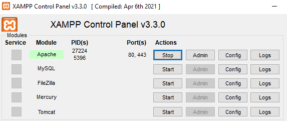
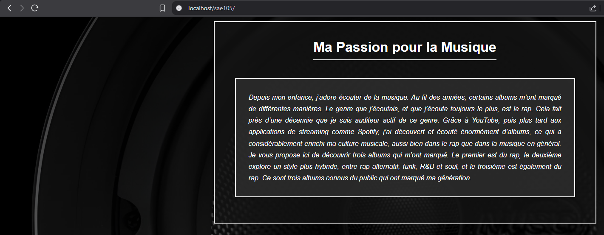

# SAÉ 1.05 - Produire un site web : [Ma Passion pour la Musique]

## Informations générales
* **Auteur :** [Sami_Belkedah]
* **URL du site hébergé :** http://belkedah.projetsmmichamps.fr/sae105 
* **Lien vers le tableur Opquast (Notion) :** https://www.notion.so/Opquast-SA-1-05-Ta-passion-en-images-2dda07ca045d813b97d9e793ae263460?source=copy_link 

## Structure du projet
Le projet respecte une arborescence clair pour une meilleure maintenance :
* `/index.html` : Page principale
* `/HTML/` : Pages secondaires (Mentions Légales)
* `/CSS/` : Feuilles de style
* `/JavaScript/` : Logique (script.js) et données (data.js)
* `/images/` : Médias optimisés

## Fonctionnalités techniques
1. **Génération automatisée** : Les albums sont générés via JavaScript à partir d'un fichier de données, permettant une mise à jour facile.
2. **Design Z-Pattern** : Alternance automatique gauche/droite gérée par script.
3. **Interactivité** : Système de zoom (popup) et validation de formulaire intégrés.

## Procédure d'installation sur serveur local XAMPP
1. **Configuration du serveur :**
   - J'ai téléchargé et installé la distribution **XAMPP**.
   - J'ai lancé le **XAMPP Control Panel** et démarré le module **Apache**. Une fois le voyant passé au vert, mon ordinateur est devenu un serveur web local capable d'interpréter mes fichiers.

2. **Déploiement des fichiers :**
   - Je me suis rendu dans le répertoire racine de XAMPP : `C:\xampp\htdocs`.
   - J'y ai créé un dossier nommé `sae105` pour organiser mon projet.
   - J'ai copié l'intégralité de mes dossiers (`CSS`, `HTML`, `images`, `JavaScript`) et mon fichier `index.html` dans ce répertoire.

3. **Tests et Validation :**
   - J'ai accédé à mon site via l'URL : `http://localhost/sae105/`.
   - Cette étape m'a permis de vérifier que mon script **JavaScript** chargeait correctement mes données et que la fonctionnalité de **zoom** demandée fonctionne parfaitement avant l'hébergement final.

**Note :** Vous trouverez ci-dessous les captures d'écran de mon panneau de contrôle XAMPP et du rendu du site en local.

### Preuves de fonctionnement

*1 : Module Apache activé sur le port 80*

*2 : Test du site sur le serveur local*